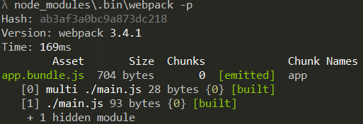

# Webpack Build

I decided to build this project in vanilla JS and decided to use WebPack in order to learn it.

I'm also a heavy user of the Angular cli which abstracts webpack's functionality, so it is also useful to learn a bit about the tool which is running behind the curtains.

I soon realized that the build process escalated quite quickly. The angular cli provides many convenient functionalities such as creating a js and css bundle which are later inserted into the index.html file, and each of these functionalities translated into an extra plugin.

In this guide i will be explaining both my thought process as well as some of webpack's features.

## Table of Contents

1. Setting up Webpack 
    1. Basic Configuration
    2. Node Scripts
2. Plugins
    1. Sass
    2. Html (index)
    3. Html Loader
    4. Dev Server
    5. Markdown Loader
3. Code Helpers
    1. ESLint
    2. Babel

### Setting up Webpack

#### Basic Configuration

You can install webpack with the command  `npm install webpack --save-dev`.

The next step is to create the `webpack.config.js` file, so i could start configuring my build process.

Initial webpack.config.js

```javascript
var path = require('path'); // allows the resolve to be relative to the current path

module.exports = {
  context: path.resolve(__dirname, './src'),
  entry: {
    app: ['./main.js']
  },
  output: {
    path: path.resolve(__dirname, './dist'),
    filename: '[name].bundle.js',
  },
  module: {
    rules: [
    ]
  },
  plugins: [
  ]
};

```
`entry` is where you define your bundle entry points. My config is telling webpack _read the module in the file main.js_.

`app` is the name of the bundle, resolving `[name].bundle.js` into `app.bundle.js`.

`output` is the result of webpack's compilation. Here i tell webpack to create a file `app.bundle.js` which will include all the content located in `main.js` including the files that `main.js` is importing, this file will be created in the `dist` directory.

Ok! let's see this in action. You can call webpack by running it from the node_modules, just type in the console:

```
node_modules\.bin\webpack -p
```
You should see something like this:



And if you check your folder, webpack has now created a `dist` folder with the bundle contents inside. Further compilations will replace previous ones.

#### Node Scripts

Now that i have webpack running, i decided to add some node scripts to automate webpack's build process. In the package.json file i added the scripts object:

```json
"scripts": {
    "build": "webpack -p",
    "watch": "webpack --watch"
  }
```
We can see the addition of a new command `--watch`. This command automatically recompiles our build everytime it detects the files has been changed.

In order to run these commands just type `npm run <command>`, this would translate into `npm run build` if we want to build our project. 

### Plugins

After having the basic build process set up and working i started adding optimization steps to add more functionalities to the project.

Webpack is very flexible when it comes to extra functionalities, and these come in the form of plugins. These allow you to automatically com

#### Sass

There are many ways you can bundle css, i decided to both use a preprocessor and bundle it in a separate file. In order to do this, you will need to run the following line:

```
npm install css-loader node-sass sass-loader extract-text-webpack-plugin --save-dev --save-dev
```

We need `css-loader` to process CSS files. `sass-loader` and its dependency ` node-sass` allows us to compile .scss files to css. Lastly, `extract-text-webpack-plugin` extracts text from a bundle into a file, allowing us to have a file for the bundled js and another for the bundled css.

In the `webpack.config.js` file:

```javascript
...
const ExtractTextPlugin = require("extract-text-webpack-plugin");
...
module.exports = {
  ...
  module: {
    rules: [      
      { // rule for standard css files
        test: /\.css$/,
        loader: ExtractTextPlugin.extract({
          loader: 'css-loader',
          options: { importLoaders: 1 }
        }),
      },
      { // loader used to compile sass files
        test: /\.(sass|scss)$/,
        loader: ExtractTextPlugin.extract(['css-loader', 'sass-loader'])
      }
    ],
    plugins: [
      new ExtractTextPlugin({
        filename: '[name].bundle.css',
        allChunks: true,
      })
    ]
  }
  ...
}
```

Another very important step is to include the sass file for each component so they get imported into the resulting css file. Say i want the create the header component, in the header.js you insert `require('./header.scss')`.

#### Html (index)

Today we might be using Sass, but tomorrow, who knows?</br>
Our bundles will need to be included in the index.html file:
```HTML
<!DOCTYPE html>
<html>

<head>
    <meta charset="UTF-8">
    ...

    <link href="app.bundle.css" rel="stylesheet">
</head>

<body>
    <script type="text/javascript" src="app.bundle.js"></script>
</body>

</html>
```

But having to manually include the bundles is a boring and error prone procedure. In order to keep our build process scalable and automatic i decided to use the following package:

```
npm install html-webpack-plugin --save-dev
```
This plugin creates and inserts the bundle files into the index.html file. It also supports templates, what this means is that you can have an index.html file created by you with all the metadata you want to add and the plugin will insert the scripts after running webpack compilation.

In the webpack.config.js

```javascript
...
module: {
  ...
  plugins: [
    ...
    new HtmlWebpackPlugin({
      template: 'index.html'
    })
  ]
}

```

#### HTML Loader

What if we have multiple Html files?

`npm install html-loader --save-dev`

in the rules section

```javascript
module.exports = {
  ...
  module: {
    rules: [
      {
        test: /\.(html)$/,
        use: {
          loader: 'html-loader'
        }
      },
      ....
    ]
  }
}
```

This allows you to import your html file as a string to a variable.

```javascript
  const template = require('./header.html');
```

#### Web Server

Another very useful feature is having webpack automatically compile and show it to you immediately! this is called `live reloading` and we can achieve this with the dev-server plugin:

```
npm install webpack-dev-server --save-dev
```

In the webpack.config.js file you can just add the following line:

```javascript
...
module.exports = {
  ...
  plugins: [
    ...
    devServer: {
      contentBase: path.resolve(__dirname, './dist')
    }
  ]
}
```
And in the package.json file you can add the command:
```json
...
"scripts": {
  ...
  "serve": "node_modules/.bin/webpack-dev-server"
}
```
If you run `npm run serve` webpack will host a server instance in the address `http://localhost:8080/` and if you change any file it will automatically recompile it and reflect the changes in the browser.

#### Markdown Loader

`npm install --save-dev markdown-loader` for markdown import

```javascript
module.exports = {
  rules: [{
    test: /\.md$/,
    use: [
      {
          loader: "html-loader"
      },
      {
          loader: "markdown-loader",
          options: {
              /* your options here */
          }
      }
    ]
  }]
  },
    ...
```

`import WebpackBlog from '../../blog/webpack/webpack-build.md';` to import the md content to a var

`npm install --save-dev file-loader` for png

```javascript
module.exports = {
  rules: [
    {
      test: /\.(png|jpg|gif)$/,
      use: [
        {
          loader: 'file-loader',
          options: {}  
        }
      ]
    }
  ]
  ...
}
```

### Code Helpers

TODO: Things that improve our workflow

#### ESLint

Linting derives from `Lint`, a software originally written for the C language which flagged suspicious behaviors by performing `static analysis`. Basically it will look at the code and point out obvious errors or improvements which you can perform without even needing to run the code. 

Most projects also use some sort of linting, therefore learning to use one is highly beneficial. I passively used the one angular-cli provides out of the box, but i really started looking at it more carefully after having to follow a lint config for a job interview assignment.

Another great benefit is helping you learn the language. For example after my linting warned me over and over to use `let` instead of `var` and even `const` in some situations, it made me research on these declaration which in turn led me to understand them and make my code more safe and optimized.

Lastly, because big projects are prone to become confusing due to each developer's own coding style, linting helps the project maintain a consistent style throughout. One example would be a rule to enforce component selectors prefix.

One of the most popular linting plugins is ESLint, it includes big name companies coding styles, such as Google or AirBnB.

You will first need to install eslint:
```
npm install eslint --save-dev
```
Then you can install the loader for webpack:
```
npm install --save-dev eslint-loader
```
This will allow webpack to include linting when compiling your code, with immediate feedback in the console whenever something does not comply to the linting rules.

Initialize the linting file:
```
$ ./node_modules/.bin/eslint --init
```
This file includes your linting rules, if some rules are inconvenient for you, feel free to turn them off.

Here is a basic setup to get you started:
```javascript
module.exports = {
    "extends": "eslint:recommended",
    "env": {
        "browser": true,
        "es6": true
    },
    "parserOptions": {
        "sourceType": "module"
    },
    rules: {
        "no-console": 0
    }
};
```

You can check the documentation [here](http://eslint.org/docs/user-guide/configuring "ESLint Configuration")

However, you will want to have linting in the IDE and not just when you compile your code, this will allow you to have instant feedback and improve your work greatly.

For Visual Studio (VS) Code, simply add the extension `ESLint`

#### Babel

We will need to install the following packages:

`npm install --save-dev babel-loader babel-core babel-preset-env webpack`

Where `babel-loader` allows webpack to run babel. `babel-core` adds the babel functionalities and `babel-preset-env` is used in association with a babel config file to  [cenas](https://babeljs.io/docs/plugins/preset-env/) 

In `Webpack.config.js` before any other rules add:
```javascript
module {
    rules: [ // Transpiling rules come first
      { 
        test: /\.js$/, 
        exclude: /node_modules/, 
        loader: "babel-loader" 
      }
      ...
    ]
```
This will ensure  you will not have undefined errors from transpiled code.

#### SourceMaps

While minifying and/or uglifying the source code brings massive performance advantages, it becomes impossible for developers to debug mangled code.

Fortunately there are source maps, these map the transformed code to the original source. Meaning that when we inspect the source we can see it in a readable format, making debugging very natural.

To activate this feature we just add the following line to webpack:

```javascript
module.exports = {
  ...
  devtool: 'source-map'
}
```

#### Normalize.css

Some Html components have baseline css properties, for example, H1 has bolder and bigger text than H2. However some elements have incosistent styling between the different browsers, this library will provide that consistency.

However, keep in mind this is `not a css reset`, it does not remove the baseline styles from the html elements.

We can installing it by running the install command:

```
npm install --save normalize.css
```

And to use it, we just need to require it (i'm doing it on my main.js):

`require('normalize.css')`

If ESLint complains about require, just add this section in `.eslintrc.js`

```javascript
"env": {
  ...
  "node": true
}
```

## Sources

https://www.npmjs.com/package/eslint-webpack
https://github.com/MoOx/eslint-loader
https://webpack.github.io/docs/tutorials/getting-started/